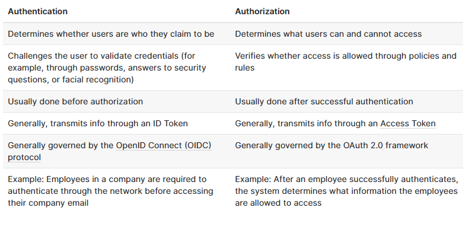
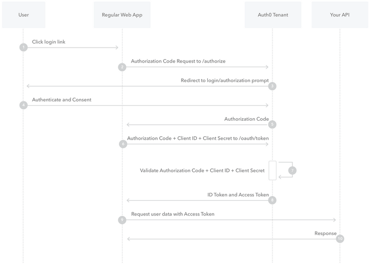
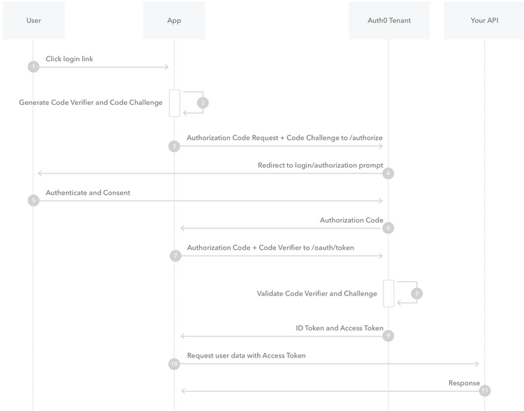
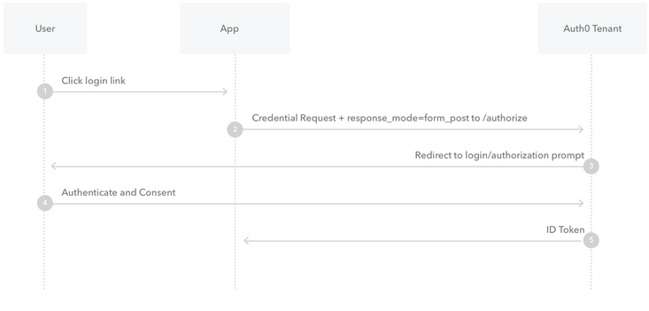
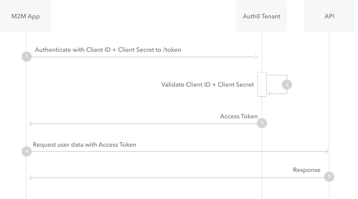
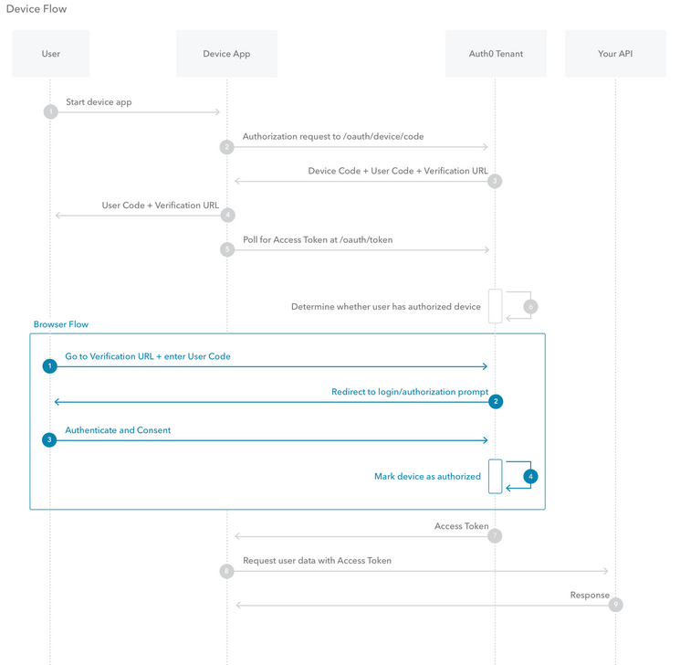
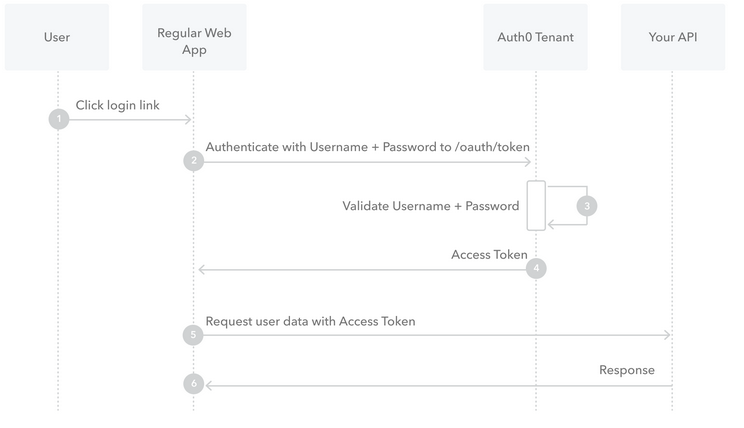

# [Back to Main Page](https://reecerenninger.github.io/reading-notes/)

## Notes: Authentication

[What is OAuth](https://www.csoonline.com/article/3216404/what-is-oauth-how-the-open-authorization-framework-works.html)

1. OAuth is an open-standard authorization protocol or framework that describes how unrelated servers and services can safely allow authenticated access to their assets without sharing the login credentials.  Essentially, its a safeway to authorize login information without exposing the credentials themselves.
2. One example provided in the reading of how OAuth would look is when we send cloud store filed to another user via email. OAuth could be used behind the scenes to allow the email system to send the files attached to the email and authenticate.
3. OAuth utilizes one-time tokens per transaction to be provided to the software as a request token and a secret token to their authorization provider.  If approved the user receives an access token which goes to the website and first website gives the access token to second website as proof of authentication.
4. OpenID started in 2005 as a way to log into LiveJournal blogging site but spread to other sites.  It allowed for a single sign-on to vouch for identities of users. OpenID fell off due to FaceBook doing the same thing years later and being more widely known.  However, OAuth was birthed from OpenID that have the two technologies now complementing each other.

[Authorization and Authentication flows](https://auth0.com/docs/flows)

1. Authentication is the process of verifying who a user is while authorization is the process of verifying what they have access to.

2. The Authorization code flow is the user clicking login, Auth0's SDK redirects the user to the authorization prompt, user authenticates using one of the login options and consent to permissions of the Auth0, the authentication redirects the user back to application, the code goes through the authentication server, the server verifies the code and client ID secret, then ID token and access are used and the API responds with the data.

3. PKCE authentication is very similar to the steps above however utilizes code challenge and code verifier.

4. The implicit flow starts with user clicking login, the credential request and response mode goes to authorization, then redirect to login and authorization prompt, authenticate and consent, and then ID token is sent to user.

5. The client credentials starts with application authenticating with server using Client ID and Client Secret, the id and secret get validated and responds with an access token, user data is requested with access token, then API responds with data.

6. The device authorization flow starts with the device app starting, authorization request goes to the OAuth, device code + user code + verification url, the device asks the user to interact in some way, a poll occurs to get the AuthO authorization for access token, the browser user flow kicks in now with the user code being entered and redirects to login with consent prompt, the user authenticates using a login option, the device is then authorized access to the API, then the device can use the access token to call the API for information about the user and the API responds with the data.

7. The resource owner password flow begins with the user click login with their application, application forwards user credentials to AuthO server, the server validates credentials and responds with an access token, the application can then use the access token to call an API to get information about the user and the API responds with requested data.

## Bookmark

[Auth0 for single page apps](https://auth0.com/docs/libraries/auth0-react)

## Class Notes

## Things I want to know more about
