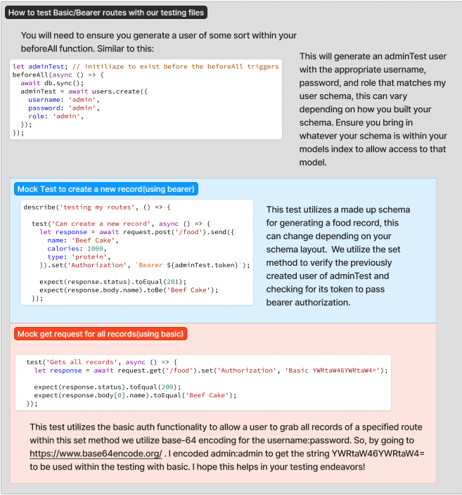

# [Back to Main Page](https://reecerenninger.github.io/reading-notes/)

## Cheat sheet to Stacks and Ques & Cheat Sheet to testing Bearer/Basic Auth



[Stacks and Ques](https://codefellows.github.io/common_curriculum/data_structures_and_algorithms/Code_401/class-10/resources/stacks_and_queues.html)

### What is a Stack?

    A stack is a data structure that consists of Nodes. Each Node references the next Node in the stack, but does not reference its previous.
   Common Terminology:

- **Push**: Add nodes or items into the stack.

- **Pop**: Remove nodes or items from the stack. Raises an exception when stack is empty.

- **Top**: The top of the stack.

- **Peek**: View the value of the top Node in the stack. Raises an exception when stack is empty.

- **IsEmpty**: Returns true when stack is empty, otherwise returns false.

- **Key Concepts**: FILO (First In Last Out), LIFO (Last In First Out).

- Operations are typically O(1) since they depend only on the top element, not on the number of elements in the stack.

**FILO(First In Last Out)**

- This means that the first item added in the stack will be the last item popped out of the stack.

**LIFO(Last In First Out)**

- This means that the last item added to the stack will be the first item popped out of the stack.

### Big O(1) operations with Stack

- Push O(1)

      Pushing a Node onto a stack will always be an O(1) operation. This is because it takes the same amount of time no matter how many Nodes (n) you have in the stack.

      When adding a Node, you push it into the stack by assigning it as the new top, with its next property equal to the original top.
      
```javascript
ALOGORITHM push(value)
// INPUT <-- value to add, wrapped in Node internally
// OUTPUT <-- none
   node = new Node(value)
   node.next <-- Top
   top <-- Node

```

- Pop O(1)

      Popping a Node off a stack is the action of removing a Node from the top. When conducting a pop, the top Node will be re-assigned to the Node that lives below and the top Node is returned to the user.

      Typically, you would check isEmpty before conducting a pop. This will ensure that an exception is not raised. Alternately, you can wrap the call in a try/catch block.

```javascript
ALGORITHM pop()
// INPUT <-- No input
// OUTPUT <-- value of top Node in stack
// EXCEPTION if stack is empty

   Node temp <-- top
   top <-- top.next
   temp.next <-- null
   return temp.value

```

- Peek O(1)

      When conducting a peek, you will only be inspecting the top Node of the stack.

      Typically, you would check isEmpty before conducting a peek. This will ensure that an exception is not raised. Alternately, you can wrap the call in a try/catch block.

```javascript

ALGORITHM peek()
// INPUT <-- none
// OUTPUT <-- value of top Node in stack
// EXCEPTION if stack is empty

   return top.value


```

- isEmpty(1)

```javascript

ALGORITHM isEmpty()
// INPUT <-- none
// OUTPUT <-- boolean

return top = NULL

```

### Big O(1) operations with Queue

- Enqueue O(1)

      When you add an item to a queue, you use the enqueue action. This is done with an O(1) operation in time because it does not matter how many other items live in the queue (n); it takes the same amount of time to perform the operation.

```javascript
ALGORITHM enqueue(value)
// INPUT <-- value to add to queue (will be wrapped in Node internally)
// OUTPUT <-- none
   node = new Node(value)
   rear.next <-- node
   rear <-- node

```

- Dequeue O(1)

      When you remove an item from a queue, you use the dequeue action. This is done with an O(1) operation in time because it doesn’t matter how many other items are in the queue, you are always just removing the front Node of the queue.

      Typically, you would check isEmpty before conducting a dequeue. This will ensure that an exception is not raised. Alternately, you can wrap the call in a try/catch block.

```javascript
ALGORITHM dequeue()
// INPUT <-- none
// OUTPUT <-- value of the removed Node
// EXCEPTION if queue is empty

   Node temp <-- front
   front <-- front.next
   temp.next <-- null

   return temp.value

```

## Things I want to know more about
